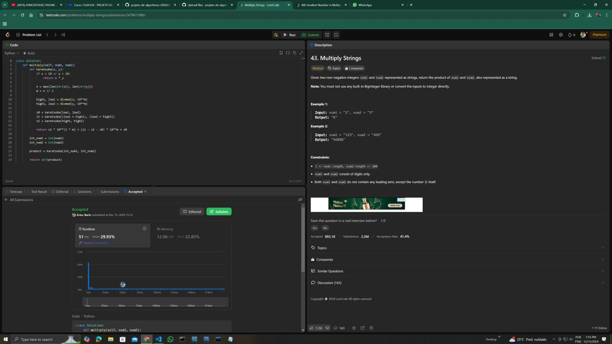
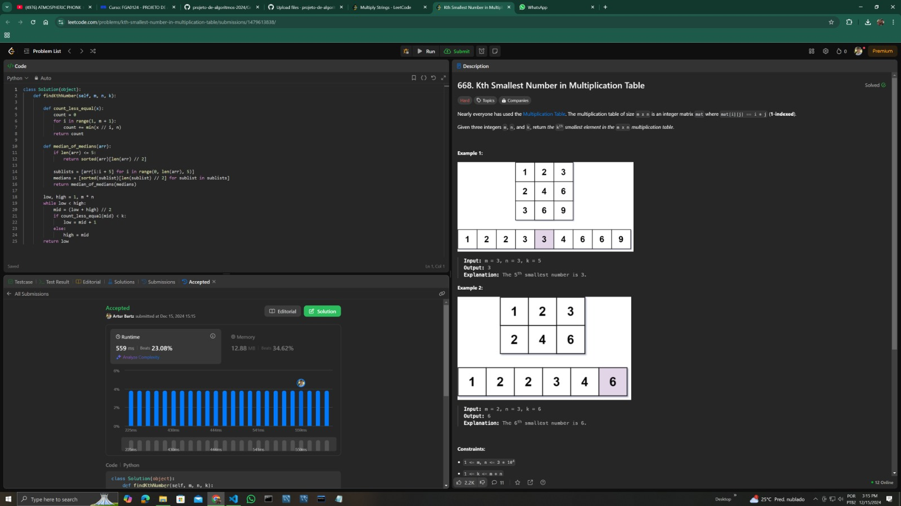
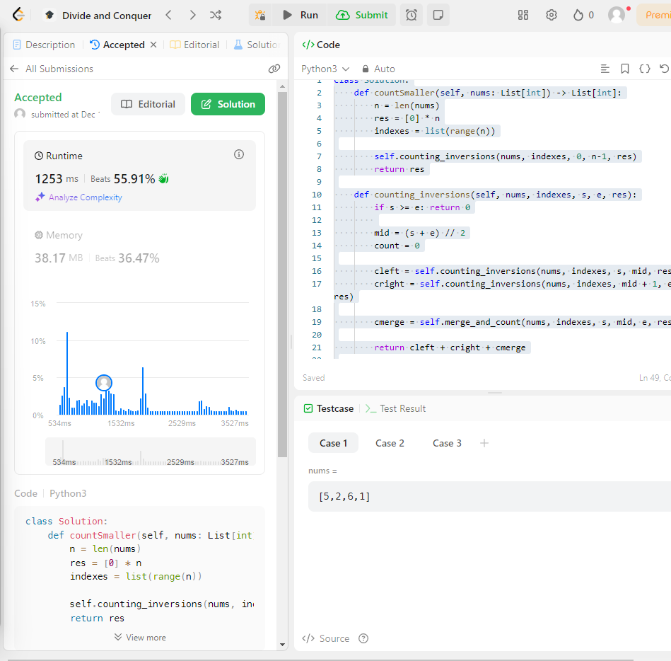

# DividirConquistar_LeetCodeProblems

**Número da Lista**: 01<br>
**Conteúdo da Disciplina**: Dividir e Conquistar (D&C)<br>

## Alunos
|Matrícula | Aluno |
| -- | -- |
| 221007869  |  Artur Henrique Holz Bartz |
| 221008267  |  Lucas Gama de Araujo Bottino |

## Sobre 
O projeto consiste em resolver 4 questões da plataforma LeetCode, sendo duas dífíceis e duas médias. A definição de fácil, médio e difícil é concebida pela plataforma.

Questões Implementadas:
Questão 43. Multiply Strings (Dificuldade: Média). Disponível em : (https://leetcode.com/problems/multiply-strings/description/);<br>
Questão 668. Kth Smallest Number in Multiplication Table (Dificuldade : Difícil). Disponível em : (https://leetcode.com/problems/kth-smallest-number-in-multiplication-table/description/);<br>

Para o desenvolvimento da questão média 43 foi utilizado o algoritmo de Karatsuba (Multiplicação). Já para o desenvolvimento da questão difícil 668 foi utilizado o algoritmo de Mediana das medianas (MoM - Median of Medians). Em ambos os casos a linguagem utilizada foi Python e, além disso, houve a utilização dos algoritmos abordados em sala de aula com pequenas modificações para estarem de acordo com a solução do problema proposto, porém mantendo-se dentro do conteúdo proposto em sala de aula.

## Screenshots
Screenshot da Questão 43:<br>

Screenshot da Questão 668:<br>

Screenshot da Questão 315:<br> 


## Instalação 
**Linguagem**: Python (Questões 43,668 e 315)<br>
**Framework**: Não há frameworks para este projeto.<br>
Para a execução do projeto deve ser instalado o python 3.11.4 ou superior.

## Uso 
Para rodar as questões 43, 668 e 315 deste projeto, basta entrar na raiz do projeto e executar o arquivo referente a questão que se deseja avaliar, por exemplo. Ou ainda, submeter o código sem os casos de teste no LeetCode:
```
python 43.MultiplyStrings.py
```
```
python 668.KthSmallestNumberinMultiplicationTable.py
```
```
python 315.CountOfSmallerNumbersAfterSelf.py 
```

## Outros 
Desconsiderar os casos de teste ao final dos arquivos .py ao tentar submeter ao leetcode. Essas linhas foram implementada apenas com o intuito de testar casos base.

## Vídeo
Disponível em: 


